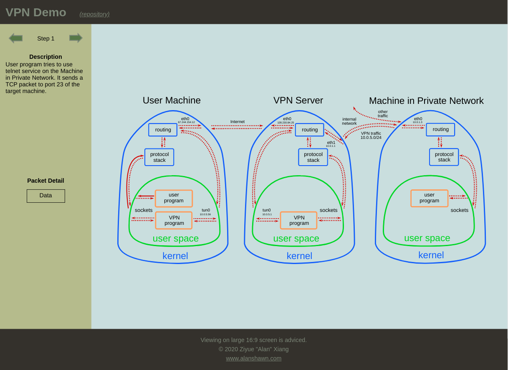

# VPN Demo

An interactive demonstration of how VPN works.

## How to modify the site

1. The schematic diagram is drawn in `./svg/diagram-inkscape.svg`. Every arrow in the SVG image has an alias so that they can be easily navigated. These alias mappings are defined in `./python/path_mapping.py`. If you are to modify the SVG objects, save the SVG to `./svg/diagram-plain.svg` as "plain SVG" and run `./python/sanitize_svg_style.py`. This script will automatically convert the SVG to web-friendly format. The result will be saved to `./diagram-css.svg`, which is used by the webpage.

2. The scenes of the web page are defined in `./python/vpn_steps.py`. The script will generate `./vpn-cmd.js`.

## How to view the site locally

Run `./python/run_html_server.py` (requires Python 3).
